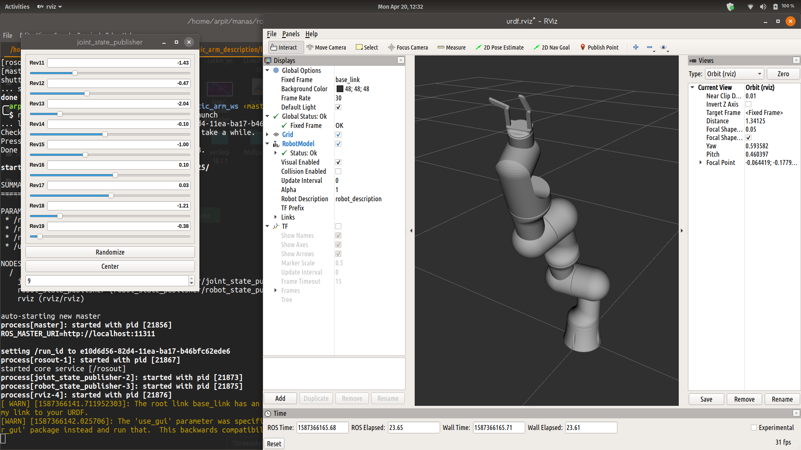
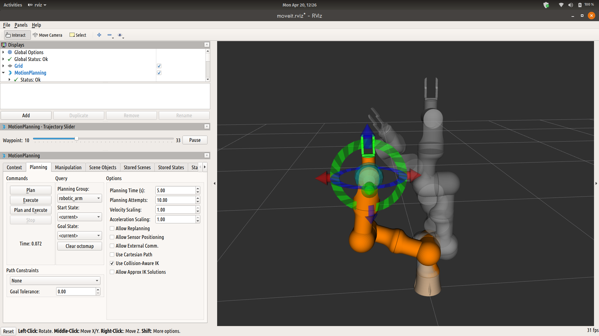
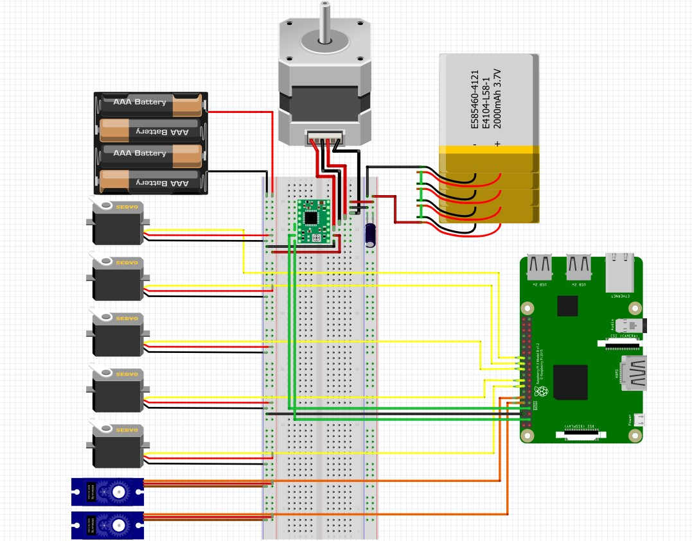
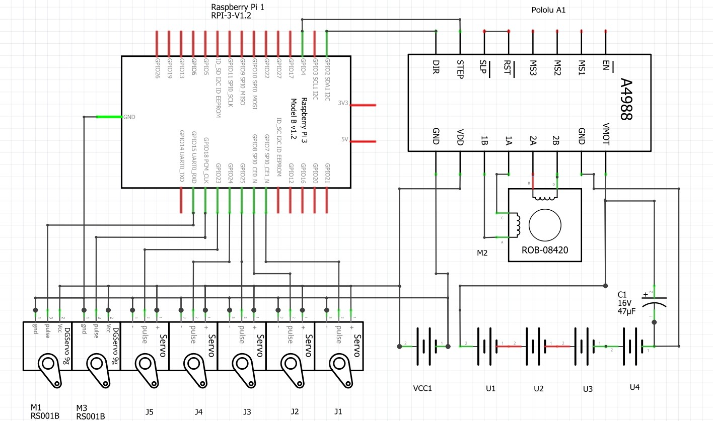

# 7DOF Robotic Arm task

* ROS Workspace for 7 dof robotic arm with Fusion-360 model, Fritzing file, electronic circuits and schematics.

* I assume the Software task is aimed at testing the ROS specific skiils and therefore I am using the robotic arm from the Hardware task for simulation in Gazebo. 

* Motion planning is done using MoveIt and it will be controlled either by a keyboard or joystick.

## Gazebo URDF

## MoveIt motion planning

## Circuit connections

## Circuit schematics
